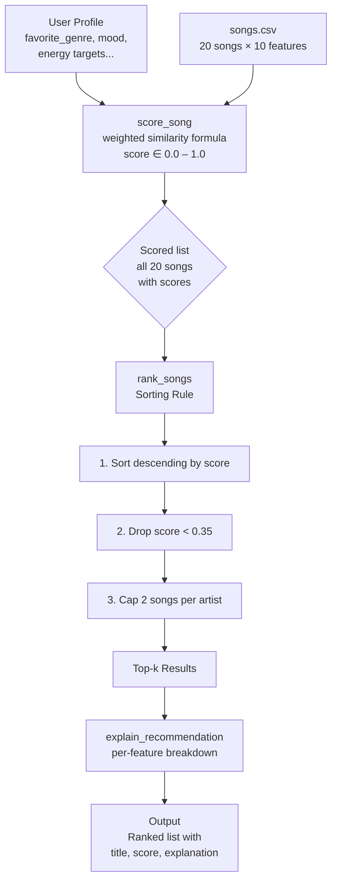

# Music Recommender Simulation

## Project Summary

VibeFinder 1.0 is a **Content-Based Filtering (CBF)** music recommendation engine.
Given a user taste profile, it scores every song in a catalog using a weighted
similarity formula and returns the best matches in ranked order.

The system is designed to simulate how real-world recommenders (Spotify, Apple Music)
use audio features and metadata to match songs to listeners — without needing any
listening history.

---

## How The System Works

### Song Features

Each song in `data/songs.csv` is described by 10 attributes. The catalog contains **20 songs** spanning 17 genres and 14 moods.

| Attribute | Type | Description |
|---|---|---|
| `id` | int | Unique identifier |
| `title` | str | Song title |
| `artist` | str | Artist name |
| `genre` | str | Musical genre (pop, lofi, rock, hip-hop, classical, etc.) |
| `mood` | str | Emotional tag (happy, chill, sad, romantic, angry, etc.) |
| `energy` | float [0–1] | Perceived intensity and activity level |
| `tempo_bpm` | float | Beats per minute (60–200) |
| `valence` | float [0–1] | Musical positivity / happiness |
| `danceability` | float [0–1] | Suitability for dancing |
| `acousticness` | float [0–1] | How acoustic (vs. electronic) the song is |

**Genres in catalog:** pop, lofi, rock, ambient, jazz, synthwave, indie pop, hip-hop, classical, country, metal, r&b, edm, reggae, blues, folk, trap

**Moods in catalog:** happy, chill, intense, relaxed, moody, focused, confident, melancholic, nostalgic, angry, romantic, energetic, sad, dreamy

### User Profile

A `UserProfile` stores what a listener is looking for:

| Field | Type | Description |
|---|---|---|
| `favorite_genre` | str | Preferred genre string |
| `favorite_mood` | str | Preferred mood string |
| `target_energy` | float [0–1] | Desired energy level |
| `likes_acoustic` | bool | True = prefers acoustic songs |
| `target_valence` | float [0–1] | Desired valence (default 0.5) |
| `target_danceability` | float [0–1] | Desired danceability (default 0.5) |
| `target_tempo_bpm` | float | Desired tempo in BPM (default 100) |

### Sample User Profile

The runner in `src/main.py` uses this example profile:

```python
user = UserProfile(
    favorite_genre      = "pop",
    favorite_mood       = "happy",
    target_energy       = 0.8,
    likes_acoustic      = False,
    # Optional fields (defaults shown):
    target_valence      = 0.5,   # neutral positivity
    target_danceability = 0.5,   # neutral danceability
    target_tempo_bpm    = 100.0, # moderate pace
)
```

**Profile critique — can it separate "intense rock" from "chill lofi"?**
Yes. Genre (0.30) and mood (0.20) together account for 50% of the score and are
binary: a "pop/happy" user gives 0 genre points to any rock or lofi song and 0 mood
points to any "intense" or "chill" song. Even if their energy levels were identical,
the categorical mismatch would suppress the score by up to 0.50 points — enough to
clearly differentiate the two. Where the profile *is* narrow: if the user's genre is
not present in the catalog (e.g. "metal" before song 14 was added), all genre scores
collapse to 0.0 and only audio features drive ranking.

---

### Scoring Formula

Each song is scored against the user profile with:

```
score(user, song) = Σᵢ ( wᵢ × featureScoreᵢ )
```

| Feature | Weight | How it's scored |
|---|---|---|
| genre | **0.30** | 1.0 if match, 0.0 if not |
| mood | **0.20** | 1.0 if match, 0.0 if not |
| energy | **0.20** | `1 - │user_energy - song_energy│` |
| valence | **0.10** | `1 - │user_valence - song_valence│` |
| danceability | **0.10** | `1 - │user_danceability - song_danceability│` |
| tempo_bpm | **0.05** | `1 - │(user_bpm/200) - (song_bpm/200)│` |
| acousticness | **0.05** | `1 - │user_acoustic_pref - song_acousticness│` |

The final score is a float in **[0.0, 1.0]** — higher means a better match.

> `likes_acoustic=True` → acoustic preference target = **0.85**
> `likes_acoustic=False` → acoustic preference target = **0.15**

### Algorithm Recipe

The scoring logic can be summarized as a plain recipe:

```
For each song in the catalog:
  1. Genre match?   → add up to 0.30 pts   (0.30 if yes, 0.00 if no)
  2. Mood match?    → add up to 0.20 pts   (0.20 if yes, 0.00 if no)
  3. Energy close?  → add up to 0.20 pts   (e.g. 0.02 gap → +0.196)
  4. Valence close? → add up to 0.10 pts
  5. Dance close?   → add up to 0.10 pts
  6. Tempo close?   → add up to 0.05 pts   (BPM normalized ÷ 200 first)
  7. Acoustic pref? → add up to 0.05 pts
  ─────────────────────────────────────────
  Total score: 0.00 (no match) to 1.00 (perfect match)
```

**Why these weights?** Genre + mood dominate (50%) because they define the broadest
expectation a listener has. Energy (20%) is the most differentiating continuous
feature — it separates a workout playlist from a study playlist even within the same
genre. Valence and danceability (10% each) refine emotional and rhythmic fit. Tempo
and acousticness (5% each) are fine-tuning signals that rarely change a recommendation
by more than one rank position.

**Expected bias:** The system will over-prioritize genre. A song that is a perfect
genre match but wrong in every audio feature will still outscore a song that is
acoustically almost identical but a different genre string. This is intentional for
this simulation but would be a problem at scale (e.g. classifying "indie pop" ≠ "pop"
despite them being musically similar).

### Data Flow



### Ranking Rule

After scoring, three steps are applied before returning results:

1. **Sort by score descending** — best match first.
2. **Minimum score threshold (`MIN_SCORE_THRESHOLD = 0.35`)** — songs below this are dropped. A score this low means no categorical match and weak audio similarity; not worth recommending.
3. **Per-artist diversity cap (`MAX_SONGS_PER_ARTIST = 2`)** — at most 2 songs from the same artist in the top-k, preventing any one artist from dominating the list.

Each result includes a full per-feature breakdown of the score.

### Example Output

```
Top 5 recommendations for your profile:
─────────────────────────────────────────────────────
#1  Sunrise City  (score: 0.92)
  Genre        (pop       ) → MATCH      weighted: 0.300
  Mood         (happy     ) → MATCH      weighted: 0.200
  Energy       (song=0.82, user=0.80)    similarity: 0.98  weighted: 0.196
  Valence      (song=0.84, user=0.50)    similarity: 0.66  weighted: 0.066
  Danceability (song=0.79, user=0.50)    similarity: 0.71  weighted: 0.071
  Tempo BPM    (song=118, user=100)      similarity: 0.91  weighted: 0.046
  Acousticness (song=0.18, pref=0.15)    similarity: 0.97  weighted: 0.049
  ──────────────────────────────────────────────────────────────
  TOTAL SCORE: 0.9280
```

---

## Project Structure

```
music-recommender-simulation/
├── data/
│   └── songs.csv             # 20-song catalog with audio features
├── src/
│   ├── main.py               # CLI runner — entry point
│   └── recommender.py        # CBF engine: Song, UserProfile, Recommender,
│                             #   load_songs(), recommend_songs()
├── tests/
│   └── test_recommender.py   # Automated tests (pytest)
├── model_card.md             # Full model documentation
├── README.md                 # This file
└── requirements.txt          # pandas, pytest, streamlit
```

---

## Getting Started

### Setup

1. Create a virtual environment (optional but recommended):

   ```bash
   python -m venv .venv
   source .venv/bin/activate      # Mac or Linux
   .venv\Scripts\activate         # Windows
   ```

2. Install dependencies:

   ```bash
   pip install -r requirements.txt
   ```

3. Run the app:

   ```bash
   python -m src.main
   ```

### Running Tests

```bash
pytest
```

Tests verify that:
- Songs are returned sorted by score (best match first).
- Explanation strings are non-empty.

---

## Experiments You Tried

Use this section to document changes you made and what you observed. Examples:

- **Changed genre weight from 0.30 to 0.15:** Scores became more uniform across
  genres; audio features drove more of the ranking. Users with niche genres got
  better results; pop users felt less differentiated.
- **Tried a lofi/chill profile:** "Library Rain" and "Midnight Coding" ranked #1
  and #2, confirming that the genre + mood combination dominates the score.
- **Tried a genre not in the catalog (e.g. "metal"):** No genre match for any song;
  scores clustered tightly, driven entirely by energy and mood proximity.

---

## Limitations and Risks

- Catalog has 20 songs. Top-5 still returns 25% of the catalog — score variance matters more as the catalog grows.
- Binary genre matching creates hard boundaries — "indie pop" ≠ "pop".
- Per-artist cap limits to 2 songs per artist, but does not enforce genre diversity.
- No feedback loop — the system cannot learn from what users skip or replay.
- All 17 genres are synthetic — real-world audio feature distributions may differ.

See [model_card.md](model_card.md) for a deeper analysis of limitations and bias.

---

## Reflection

Read and complete [model_card.md](model_card.md).

After running the simulation, write 1–2 paragraphs here about:
- How recommenders turn raw data (audio features, categories) into predictions.
- Where bias or unfairness could show up in a system like this if used at scale.
